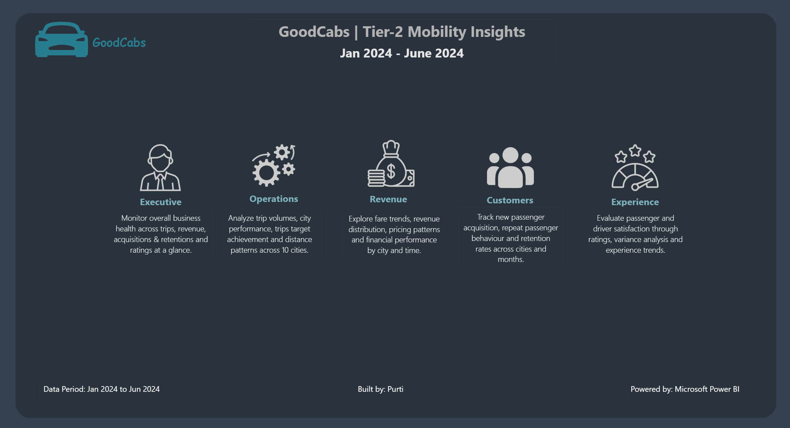
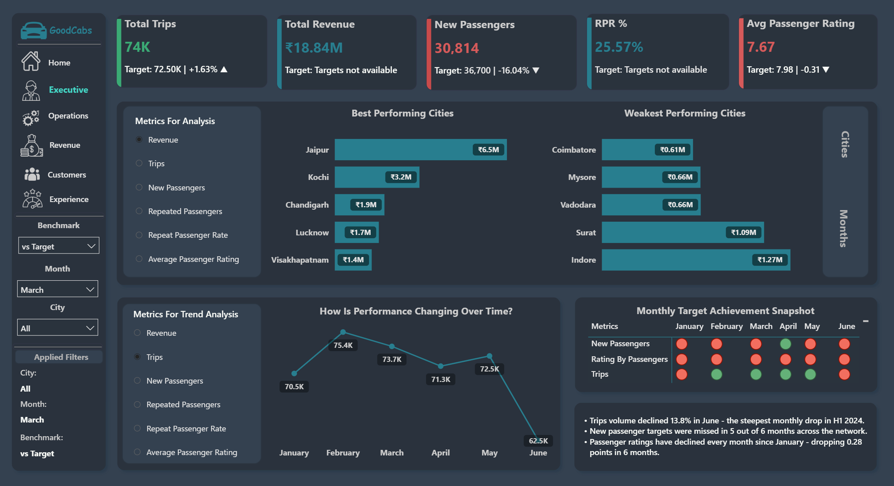
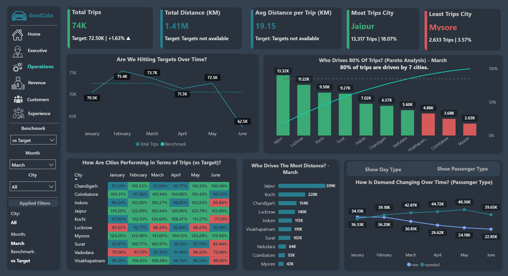
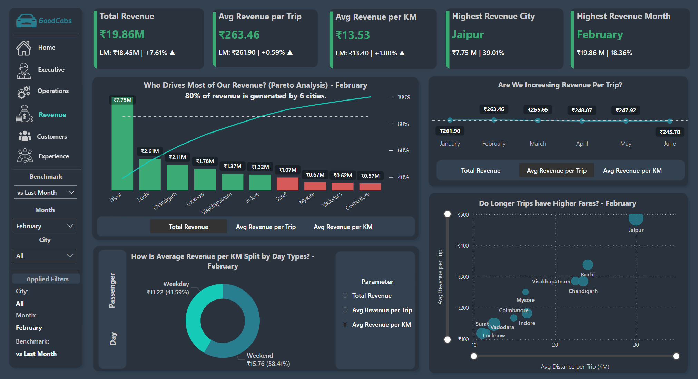
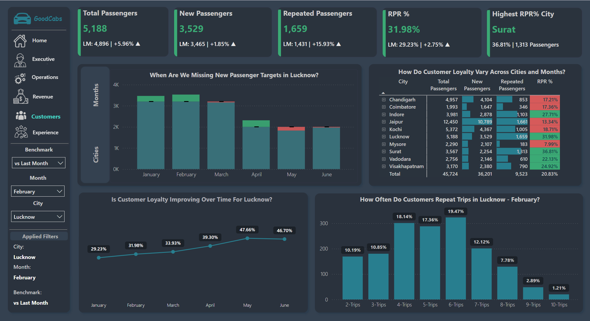
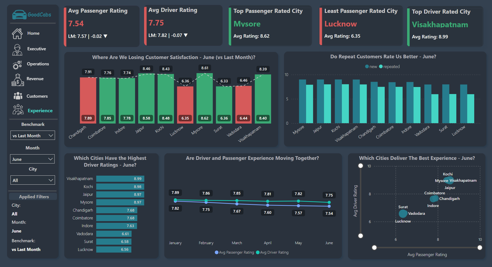
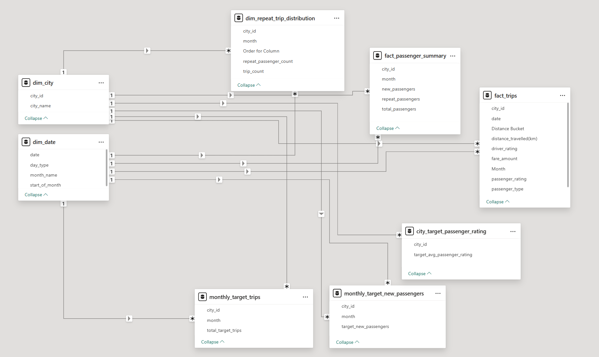

# GoodCabs | Tier-2 Mobility Insights
Power BI dashboard analyzing GoodCabs' operations across Indian cities - covering trips, revenue, passenger growth and satisfaction across 6 pages with 80+ DAX measures, 15+ tooltip pages, field parameters, dynamic bookmarks and titles.

## Why This Project Exists
GoodCabs, a cab service company established a few years ago, has gained a strong foothold in the Indian market by focusing on tier-2 cities. Unlike other cab service providers, GoodCabs is committed to supporting local drivers, helping them make a sustainable living in their hometowns while ensuring excellent service to passengers. With operations in ten tier-2 cities across India, GoodCabs has set ambitious performance targets for 2024 to drive growth and improve passenger satisfaction. 

They had data. Lots of it - but no unified view of how everything connected.

This dashboard changes that. One home page and five descrptive pages. Five different business questions. One coherent story.

- Data Period: January 2024 - June 2024
- Cities Covered: 10 Tier-2 Indian Cities
- Trips Analyzed: 425,900+

## Dashboard Preview

[View Interactive Dashboard Here](https://app.powerbi.com/view?r=eyJrIjoiNTkxMzkxNWMtNTk1Zi00M2U4LTk0ZmUtOTVjODU4ZTAzY2NmIiwidCI6ImM2ZTU0OWIzLTVmNDUtNDAzMi1hYWU5LWQ0MjQ0ZGM1YjJjNCJ9)

**Home Page**

**Executive**

**Operations**

**Revenue**

**Customers**

**Experience**

## The Data Behind It
Eight tables. One Galaxy Schema.
  1. dim_city
  2. dim_date
  3. fact_passenger_summary
  4. dim_repeat_trip_distribution
  5. fact_trips
  6. city_target_passenger_rating
  7. monthly_target_new_passengers
  8. monthly_target_trips

- [Download Data Dictionary](meta_data.txt)

- [Download Data Set](cabs_dataset/)

- Schema Screenshot

## The Six Pages

### 1. Home
Branded landing page with navigation cards and page descriptions. Each card tells you exactly what question that page answers before you click.

### 2. Executive
Audience: CEO/Senior Management
One dynamic parameter controls everything - Revenue, Trips, New Passengers, Repeat Passengers, Repeat Passenger Rate and Ratings. Best/Weakest 5 performing cities or 3 best/weakest performing months update simultaneously.
Trend line provides a month-on-month performance story for the selected parameter.
Monthly target achievement scorecard uses colored dots only - no numbers, for a quick high level overview. 

### 3. Operations
Audience: Operations Manager
Answers the hardest operational questions:
  - Are we hitting targets consistently or just occasionally?
  - Are 5 cities really carrying the entire business?
  - Which cities are holding us back every single month?
  - Is demand shifted towards weekends or weekdays?
The Pareto chart automatically colors cities based on whether they fall above or below the 60% cumulative count of trips threshold - built with dynamic DAX, not manual formatting.
The waterfall tooltip on the trend chart shows exactly which cities caused the rise or fall that month - switches dynamically between vs Target and vs Last Month.

### 4. Revenue
Audience: Finance Team
Answers:
- Who drives the most of our revenue? (Pareto Anaysis)
- Which cities earn more per trip?
- Are we sustaining revenue momentum?
- How are revenue parameters split by day type and passenger types
- Do longer trips have higher fares?
  and many more.
Three metrics (Total revenue, average revenue per trip, average revenue per km) controlled by field parameters across bar chart, trend line and donut.
The scatter plot shows whether city earnings are justified by distance or whether a city is charging premium fares for short trips. A bar chart cann't show that.

### 5. Customers
Audience: Marketing Team
The most important question here isn't how many new passegers were acquired. It's whether the ones acquired came back - and how often.
- New Passenger Acquisition vs Target
- RPR % trend over months
- Repeat Trip Frequency Distribution
- Passenger Summary Table
RPR% trends from 18.68% in January to 25.73% by June - the one genuinely positive trend in an otherwise concerning H1. But Mysore at 11.23% vs Surat at 42.63% tells you retention is not a company problem - it's a city- specific problem.

### 6. Experience
Audience: CX/Quality Team
Two sides of satisfaction - passenger and driver - analyzed simultaneusly across 10 cities and 6 months.
- Which cities deliver the best experience?
- Where are we losing customer satisfaction?
- Do repeat Customers Rate Us Better?
- Are Driver and Passenger experience moving together?
The scatter plot here is the standout visual. X-axis: Avg Passenger Rating. Y-axis: Avg Driver Rating. one Chart, both dimensions of experience, all 10 cities plotted simultaneously. Kochi, Mysore and Vishakhapatnam sit top right - both sides happy. Lucknow, Vadodara and Surat sit bottom left - neither side working. One view, full picture.

## Technical Highlights

- **15+ Tooltip Pages** - Every major visual has a contextual drill-down on hover. Main canvas stays clean. Depth is one hover away.

 - **Dynamic DAX Titles** - Chart titles are not static text. They read the active filter context and update automatically.

- **Pareto Dynamic Coloring** - Automatically colors cities green or red based on 80% threshold. Recalculates when filters change (Pareto Principle simply mean a small portion of inputs typically drives the majority of outcomes, like top cities contributing most of the revenue.)

- **8 Bookmark Toggles** - Day Type vs Passenger Type on Operations and Revenue. Month vs Cities on Executive and Customers. Clean UX without page navigation.

- **80+ DAX Meaures - Key Ones Worth Highlighting**

Dynamic Best Performing City in terms of Revenue:

Highest Revenue City = 
MINX(
    TOPN(
          1, 
          ALL(dim_city), 
          [Total Revenue],
          DESC
        ), 
    dim_city[city_name]
)

Revenue Insight for Pareto Analysis:

Dynamic Pareto Revenue Insight =
VAR cnt = 
COUNTROWS(
          (FILTER(
                  ALL(dim_city), 
                  [Cumulative Revenue % (Conditional)]<= [Pareto Line 60% Total Revenue (Conditional)]
                  )
          )
)

RETURN
IF (
    SELECTEDVALUE('Financial Parameters for City'[Financial Parameters Order])= 0, 
    "60% of revenue is generated by " & cnt & " cities.", 
    ""
  )

- **Field Parameters** - Independent field parameters used across the dashboard - each showing different KPIs trend over months/cities.

- **Applied Filters Panel** - Navigation panel shows active filters at all times using DAX text meaures. Viewers always know their context.

## What the Data Actually Said
🔴 **June was a disaster** - Trip volumes dropped 13.8% - steepest single month decline in H1. Revenue followed.

🔴 **New Passenger acquisition is failing.** - Targets missed in 5 out of 6 months. Not a one-off - a pattern.

🔴 **Ratings are quietly declining** - Every single month since January. Alraedt at 7.54 in June against a target of 7.98.

🔴 **Vadodara needs urgent attention** - Low passenger rating (6.61), consistently below trip targets, lowest revenue contribution. Three red flags, one city.

🟢 **Retention is improving** - RPR% grew from 18.68% to 25.73% in 6 months. Passengers who stay are staying more.

🟢 **Jaipur is carrying the business** - 18% of trips, 34% of revenue. One city, outsized impact.

🟡 **Concentration risk is real** - 3 cities drive 60% of all revenue. That's dependency, not diversity.

## Tools Used
  - Power BI Desktop - Dashboard development
  - DAX - 80+ measures and calculated columns
  - Power Query - Data transformation including conditional columns
  - Galaxy Schema - 8 table relationships with multiple fact tables.

## Honest Reflections
  - This took 7-8 days and roughly 80 hours.
  - The hardest part wasn't the DAX. It was deciding which visuals to remove. Every visual cut made the ones that stayed more powerful.
  - Tooltips are the most underrated feature in Power BI. They keep the main canvas clean while hiding analytical depth one hover away. Built 15+.
  - Most important lesson - a dashboard answers one clear question per visual, per page, per audience is infinitely more useful than one that tries to show everything at once.

### Let's connect and discuss data, dashboards and insights: [Linkedin](https://www.linkedin.com/in/purti1003/)

 

